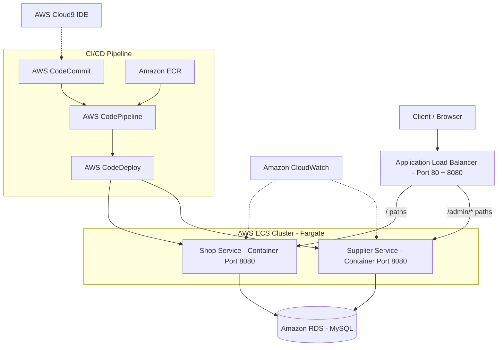
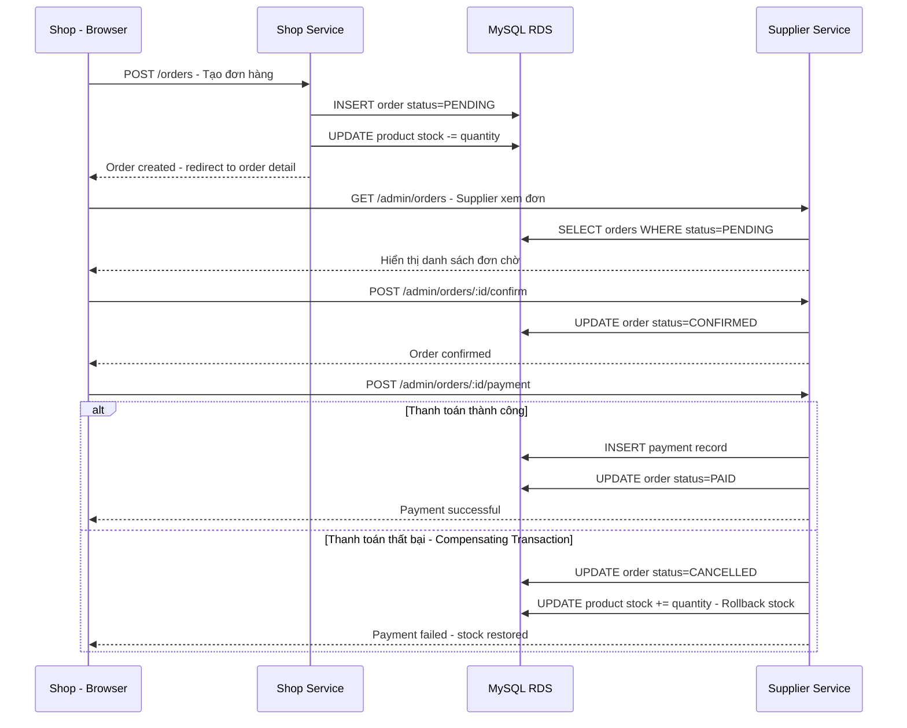

# SOA Group Project - B2B Marketplace Microservices on AWS

## Tổng quan dự án

Chuyển đổi hệ thống B2B Marketplace (từ project web hiện có) thành kiến trúc microservices và triển khai trên AWS Learner Lab. Hệ thống gồm **2 microservices** tách từ chức năng chính: **Shop Service** (cho buyer/shop) và **Supplier Service** (cho supplier/admin), kết hợp **Saga Pattern** cho quy trình đặt hàng end-to-end.

### Dựa trên project hiện có
- **Repo Frontend**: `Web_Front_SOTA` (React + TypeScript + Vite)
- **Repo Backend**: `Web_Back_SOTA` (FastAPI + PostgreSQL)
- **Roles**: Admin, Supplier, Shop
- **Chức năng chính**: Đăng nhập, quản lý sản phẩm, RFQ, báo giá, hợp đồng, đơn hàng, thanh toán

### Điều chỉnh cho AWS Lab
Để tương thích với AWS Academy Lab (monolithic Node.js app → microservices), sẽ tạo **2 microservices bằng Node.js + Express + MySQL** với giao diện server-side rendering (HTML templates), giữ nguyên logic nghiệp vụ từ project gốc.

---

## Kiến trúc hệ thống



---

## Microservices & Roles

### 1. Shop Service (Role: **Shop/Buyer** - Read + Order)
- **Mục đích**: Phục vụ buyer/shop - duyệt sản phẩm, tạo đơn hàng, theo dõi trạng thái
- **API Endpoints**:
  - `GET /` - Trang chủ Shop
  - `GET /products` - Xem danh sách sản phẩm
  - `GET /products/:id` - Chi tiết sản phẩm
  - `POST /orders` - Tạo đơn hàng mới
  - `GET /orders` - Danh sách đơn hàng của shop
  - `GET /orders/:id` - Chi tiết đơn hàng
  - `GET /login` + `POST /login` - Đăng nhập (role: shop)
- **Đặc điểm**: Chỉ READ sản phẩm + CREATE đơn hàng, không có quyền CRUD sản phẩm
- **Có link điều hướng**: sang Supplier Service `/admin/`

### 2. Supplier Service (Role: **Supplier/Admin** - Full CRUD + Payment)
- **Mục đích**: Quản lý sản phẩm, xử lý đơn hàng, xác nhận thanh toán
- **API Endpoints**:
  - `GET /admin/` - Dashboard quản trị
  - `GET /admin/products` - Quản lý sản phẩm
  - `POST /admin/products` - Thêm sản phẩm
  - `GET /admin/products/edit/:id` - Sửa sản phẩm
  - `POST /admin/products/update/:id` - Cập nhật sản phẩm
  - `POST /admin/products/delete/:id` - Xóa sản phẩm
  - `GET /admin/orders` - Danh sách đơn hàng
  - `POST /admin/orders/:id/confirm` - Xác nhận đơn hàng
  - `POST /admin/orders/:id/payment` - Xử lý thanh toán
  - `GET /admin/login` + `POST /admin/login` - Đăng nhập (role: supplier/admin)
- **Đặc điểm**: Full CRUD + xử lý payment, bảo mật bằng IP whitelist qua ALB
- **Có link điều hướng**: sang Shop Service `/`

---

## Saga Pattern - Quy trình đặt hàng End-to-End



### Failure Scenario & Compensating Transaction
1. Shop tạo đơn hàng → stock giảm, order = PENDING
2. Nếu Supplier reject hoặc payment fail:
   - Order status → CANCELLED
   - Product stock += quantity (hoàn lại tồn kho)
   - Đây là **compensating transaction** trong Saga Pattern

---

## Database Schema (MySQL)

```sql
-- Users table - phân role
CREATE TABLE users -
  id INT AUTO_INCREMENT PRIMARY KEY,
  email VARCHAR 255 UNIQUE NOT NULL,
  password_hash VARCHAR 255 NOT NULL,
  full_name VARCHAR 255,
  role ENUM shop supplier admin DEFAULT shop,
  created_at TIMESTAMP DEFAULT CURRENT_TIMESTAMP
-;

-- Products table
CREATE TABLE products -
  id INT AUTO_INCREMENT PRIMARY KEY,
  supplier_id INT NOT NULL,
  name VARCHAR 255 NOT NULL,
  description TEXT,
  price DECIMAL 12 2,
  stock INT DEFAULT 0,
  status ENUM active inactive pending DEFAULT active,
  category VARCHAR 100,
  created_at TIMESTAMP DEFAULT CURRENT_TIMESTAMP,
  FOREIGN KEY supplier_id REFERENCES users id
-;

-- Orders table
CREATE TABLE orders -
  id INT AUTO_INCREMENT PRIMARY KEY,
  shop_id INT NOT NULL,
  product_id INT NOT NULL,
  quantity INT NOT NULL,
  total_price DECIMAL 12 2 NOT NULL,
  status ENUM pending confirmed paid cancelled DEFAULT pending,
  note TEXT,
  created_at TIMESTAMP DEFAULT CURRENT_TIMESTAMP,
  updated_at TIMESTAMP DEFAULT CURRENT_TIMESTAMP ON UPDATE CURRENT_TIMESTAMP,
  FOREIGN KEY shop_id REFERENCES users id,
  FOREIGN KEY product_id REFERENCES products id
-;

-- Payments table
CREATE TABLE payments -
  id INT AUTO_INCREMENT PRIMARY KEY,
  order_id INT NOT NULL,
  amount DECIMAL 12 2 NOT NULL,
  method ENUM bank_transfer qr_code cod DEFAULT bank_transfer,
  status ENUM pending success failed DEFAULT pending,
  created_at TIMESTAMP DEFAULT CURRENT_TIMESTAMP,
  FOREIGN KEY order_id REFERENCES orders id
-;
```

---

## AWS Services sử dụng

| Service | Mục đích | Cấu hình Learner Lab |
|---------|----------|---------------------|
| **AWS Cloud9** | IDE phát triển | t3.small, Amazon Linux 2, LabVPC |
| **Amazon ECR** | Lưu Docker images | 2 repos: shop, supplier |
| **Amazon ECS Fargate** | Chạy containers | Cluster: microservices-serverlesscluster |
| **Application Load Balancer** | Path-based routing | Port 80 + 8080, rules cho / và /admin/* |
| **Amazon RDS MySQL** | Database chung | db.t3.micro, single AZ, LabVPC |
| **AWS CodeCommit** | Source control | 2 repos: microservices, deployment |
| **AWS CodePipeline** | CI/CD | 2 pipelines: shop + supplier |
| **AWS CodeDeploy** | Blue/Green deploy | ECS deployment groups |
| **Amazon CloudWatch** | Monitoring/Logs | ECS task logs |

---

## Ước tính chi phí (12 tháng - US East N. Virginia)

| Service | Cấu hình | Chi phí/tháng |
|---------|----------|--------------|
| **RDS MySQL** | db.t3.micro, 20GB gp2, Single-AZ | ~$12.41 |
| **ECS Fargate** | 3 Tasks Shop + 1 Task Supplier, 0.25 vCPU, 0.5GB each | ~$29.20 |
| **ALB** | 1 ALB, ~1 LCU avg | ~$22.27 |
| **ECR** | 2 repos, ~500MB | ~$0.05 |
| **CodePipeline** | 2 pipelines | ~$2.00 |
| **CodeCommit** | 2 repos, 1 user | Free tier |
| **CloudWatch** | Basic logs | ~$0.50 |
| **Cloud9** | t3.small, chỉ dùng khi dev | ~$15.18 |
| **Tổng** | | **~$81.61/tháng** |
| **12 tháng** | | **~$979.32** |

> ⚠️ **Learner Lab**: Chi phí thực tế thấp hơn nhiều vì chỉ chạy trong session. **PHẢI stop RDS khi không dùng** để tiết kiệm budget.

---

## Công nghệ

| Layer | Công nghệ | Lý do |
|-------|-----------|-------|
| Backend | **Node.js + Express** | Tương thích AWS Lab template |
| Database | **MySQL (RDS)** | Theo yêu cầu lab |
| Template | **HTML + Bootstrap** | Server-side rendering, đơn giản |
| Container | **Docker** | Yêu cầu bắt buộc |
| Cloud | **AWS ECS Fargate** | Serverless container |
| CI/CD | **CodePipeline + CodeDeploy** | Yêu cầu bắt buộc |

---

## Cấu trúc file sẽ tạo

```
microservices/
├── shop/                              # Shop Service (buyer)
│   ├── app/
│   │   ├── config/config.js           # DB config - RDS endpoint
│   │   ├── controller/
│   │   │   ├── product.controller.js  # Xem sản phẩm
│   │   │   └── order.controller.js    # Tạo + xem đơn hàng
│   │   └── models/
│   │       ├── product.model.js       # Product queries - read only
│   │       └── order.model.js         # Order queries - create + read
│   ├── views/
│   │   ├── home.html
│   │   ├── nav.html
│   │   ├── product-list.html
│   │   ├── product-detail.html
│   │   ├── order-create.html
│   │   ├── order-list.html
│   │   └── order-detail.html
│   ├── index.js                       # Express app, port 8080
│   ├── package.json
│   └── Dockerfile
│
├── supplier/                          # Supplier Service (admin)
│   ├── app/
│   │   ├── config/config.js
│   │   ├── controller/
│   │   │   ├── product.controller.js  # CRUD sản phẩm
│   │   │   ├── order.controller.js    # Quản lý đơn hàng
│   │   │   └── payment.controller.js  # Xử lý thanh toán
│   │   └── models/
│   │       ├── product.model.js
│   │       ├── order.model.js
│   │       └── payment.model.js
│   ├── views/
│   │   ├── dashboard.html
│   │   ├── nav.html
│   │   ├── product-list.html
│   │   ├── product-add.html
│   │   ├── product-update.html
│   │   ├── order-list.html
│   │   ├── order-detail.html
│   │   └── payment-process.html
│   ├── index.js                       # Express app, port 8080
│   ├── package.json
│   └── Dockerfile
│
deployment/
├── taskdef-shop.json                  # ECS task definition
├── taskdef-supplier.json
├── appspec-shop.yaml                  # CodeDeploy appspec
├── appspec-supplier.yaml
├── create-shop-microservice-tg-two.json
├── create-supplier-microservice-tg-two.json
└── db-init.sql                        # Database schema + seed data
```

---

## Mapping với yêu cầu SOA Group Project

| Yêu cầu | Đáp ứng | Chi tiết |
|----------|---------|----------|
| 2-3 microservices | ✅ | Shop Service + Supplier Service |
| Mỗi service có API riêng | ✅ | Shop: /, /products, /orders — Supplier: /admin/* |
| Mỗi service chạy độc lập | ✅ | Container riêng trên ECS Fargate |
| Docker | ✅ | Dockerfile cho mỗi service |
| Amazon ECR | ✅ | 2 repos: shop, supplier |
| Amazon ECS Fargate | ✅ | 1 cluster, 2 services |
| Application Load Balancer | ✅ | Path-based routing |
| Amazon RDS | ✅ | MySQL shared database |
| CI/CD Pipeline | ✅ | CodePipeline + CodeDeploy cho cả 2 services |
| CloudWatch | ✅ | ECS task logs |
| Saga workflow | ✅ | Order → Payment với compensating transaction |
| Failure handling | ✅ | Rollback stock khi payment fails |
| Architecture diagram | ✅ | Có trong report |
| Demo redeployment | ✅ | Thay đổi UI → push → pipeline tự chạy |

---

## 9 Phase thực hiện (theo AWS Lab)

| Phase | Nội dung |
|-------|----------|
| **Phase 1** | Planning - Architecture diagram + Cost estimate |
| **Phase 2** | Phân tích ứng dụng gốc (B2B Marketplace) |
| **Phase 3** | Setup Cloud9 + CodeCommit repos + push code |
| **Phase 4** | Code 2 microservices + Docker build + test local |
| **Phase 5** | Tạo ECR repos + ECS cluster + Task definitions + AppSpec |
| **Phase 6** | Tạo Target Groups + ALB + routing rules |
| **Phase 7** | Tạo 2 ECS services |
| **Phase 8** | Setup CodeDeploy + CodePipeline |
| **Phase 9** | Test CI/CD + IP restrict + Scale + Demo update |
